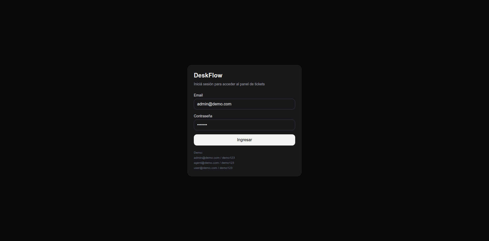
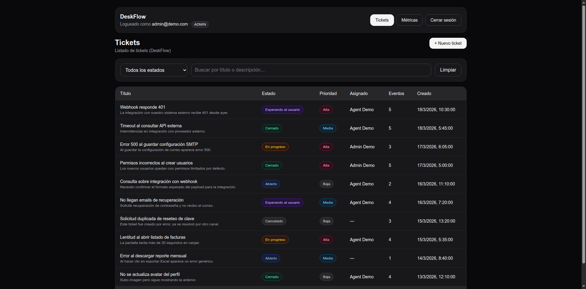
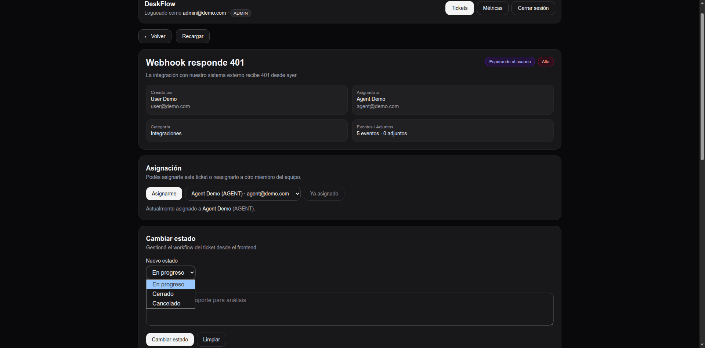
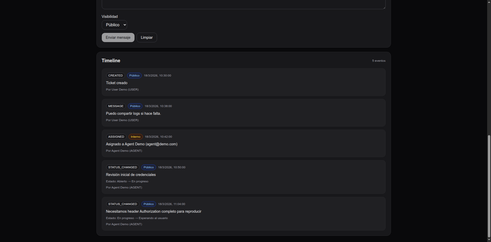
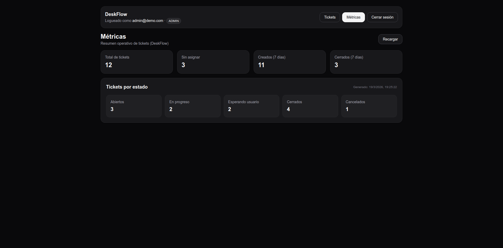
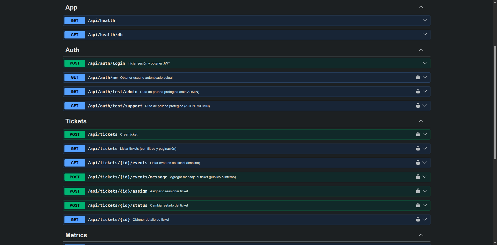

# DeskFlow

[](https://github.com/JoaquinV11/DeskFlow/actions/workflows/ci.yml)

DeskFlow es un helpdesk B2B backend-first con API REST en NestJS + Prisma/PostgreSQL y un frontend de demo en Next.js para recorrer el flujo principal del producto (login, tickets, timeline, asignación, cambio de estado y métricas).

El foco del proyecto está en el backend: autenticación, autorización por roles, reglas de negocio del workflow de tickets, timeline con visibilidad pública/interna y métricas operativas. El frontend existe como capa de demo para mostrar el flujo completo.

## Stack

### Backend

- NestJS
- Prisma ORM
- PostgreSQL
- JWT (autenticación)
- Swagger / OpenAPI
- Docker (DB local)

### Frontend (demo)

- Next.js (App Router)
- React + TypeScript
- Tailwind CSS

## Features

### Backend

- Auth con JWT (`api/auth/login`, `api/auth/me`)
- Roles y permisos (`USER`, `AGENT`, `ADMIN`)
- Creación de tickets (permitida para `USER` y `ADMIN`; `AGENT` no crea tickets)
- Listado de tickets con filtros y paginación
- Detalle de ticket
- Timeline de eventos con visibilidad `PUBLIC` / `INTERNAL`
- Comentarios en tickets (públicos e internos según rol)
- Asignación / reasignación de tickets
- Cambio de estado con transiciones válidas
- Métricas operativas (`api/metrics/overview`)
- Endpoint de usuarios asignables (`api/users/assignable`)
- Cola async de jobs con Redis + worker (BullMQ)
- Reintentos con backoff exponencial para jobs de resumen
- Idempotencia por `X-Idempotency-Key` en encolado de jobs
- Swagger con autenticación Bearer
- Seed demo realista

### Frontend (demo)

- Login con JWT
- Header global en rutas protegidas
- UI por rol (oculta acciones no permitidas)
- Lista de tickets con filtros, búsqueda y paginación
- Crear ticket desde frontend
- Detalle de ticket con timeline
- Agregar mensajes (públicos / internos según rol)
- Asignar / reasignar ticket (incluye "Asignarme")
- Cambiar estado desde frontend
- Generar resumen async de ticket desde frontend (Redis + BullMQ)
- Pantalla de métricas
- Dark mode (según tema del sistema)

## Roles demo

Usa estas credenciales para probar distintos flujos:

- `admin@demo.com` / `demo123`
- `agent@demo.com` / `demo123`
- `user@demo.com` / `demo123`

### Permisos por rol (resumen)

#### USER

- Puede iniciar sesión
- Puede crear tickets
- Puede ver solo sus tickets
- Puede comentar en sus tickets (solo mensajes públicos)
- No puede ver métricas
- No puede asignar ni cambiar estado
- No ve eventos internos

#### AGENT

- Puede iniciar sesión
- Puede ver tickets
- Puede comentar público / interno
- Puede asignar / reasignar tickets
- Puede cambiar estado
- Puede ver métricas
- No puede crear tickets

#### ADMIN

- Puede iniciar sesión
- Puede crear tickets
- Puede ver tickets
- Puede comentar público / interno
- Puede asignar / reasignar tickets
- Puede cambiar estado
- Puede ver métricas

## Flujo demo recomendado

### Flujo 1 (usuario final -> soporte)

1. Iniciar sesión como `user@demo.com`
2. Ir a **Nuevo ticket**
3. Crear un ticket con prioridad media o alta
4. Entrar al detalle del ticket
5. Agregar un mensaje público

### Flujo 2 (soporte / admin)

1. Cerrar sesión e iniciar como `agent@demo.com` o `admin@demo.com`
2. Abrir el ticket creado
3. Asignarte o reasignarlo desde el dropdown
4. Cambiar estado (`OPEN -> IN_PROGRESS -> WAITING_USER` o `CLOSED`)
5. Agregar una nota interna
6. Ver el timeline actualizado
7. Generar un **Resumen async** desde el detalle del ticket y consultar su estado
8. Ir a **Métricas** y revisar el resumen

## Arquitectura y estructura del repo

Actualmente el backend vive en la raíz del repo y el frontend de demo en `/web`.

```text
repo/
  src/                 # Backend NestJS (módulos, controllers, services)
  prisma/              # Schema, migrations y seed
  generated/           # artefactos locales generados
  web/                 # Frontend Next.js (App Router)
    src/app/
    src/components/
    src/lib/
  docker-compose.yml   # PostgreSQL local
  package.json         # Backend
```

## API Docs (Swagger)

Swagger local:

- `http://localhost:3000/docs`

Swagger en producción:

- `https://deskflow-cx1c.onrender.com/api/docs`

Notas:

- La API usa JWT Bearer en endpoints protegidos
- Swagger está configurado para persistir autorización (`persistAuthorization`)

## Endpoints principales

### Auth

- `POST /api/auth/login`
- `GET /api/auth/me`

### Health / utilidades de prueba

- `GET /api/health`
- `GET /api/health/db`
- `GET /api/auth/test/admin`
- `GET /api/auth/test/support`

### Tickets

- `POST /api/tickets` (creación de ticket; permitido para `USER` y `ADMIN`)
- `GET /api/tickets`
- `GET /api/tickets/:id`
- `GET /api/tickets/:id/events`
- `POST /api/tickets/:id/events/message`
- `POST /api/tickets/:id/assign`
- `POST /api/tickets/:id/status`

### Users

- `GET /api/users/assignable`

### Metrics

- `GET /api/metrics/overview`

### Jobs async (Redis + worker)

- `POST /api/jobs/ticket-summary` (encola generación de resumen de ticket)
- `GET /api/jobs/:id` (consulta estado y resultado del job)

## Requisitos

- Node.js 20+
- pnpm
- Docker + Docker Compose

## Setup local

### 1) Clonar e instalar dependencias (backend)

```bash
pnpm install
```

### 2) Levantar PostgreSQL con Docker

```bash
sudo docker compose up -d
```

Verificar logs (opcional):

```bash
sudo docker compose logs -f db
```

### 3) Configurar variables de entorno (backend)

Crear `.env` en la raíz del repo (backend) tomando como base `.env.example`.

### 4) Ejecutar migraciones y cargar seed demo

#### Opción normal (si ya tenés DB levantada)

```bash
pnpm prisma migrate dev
pnpm seed
```

#### Opción reset completo (recomendado para volver al estado demo exacto)

```bash
pnpm prisma migrate reset --force
```

### 5) Levantar backend

```bash
pnpm start:dev
```

API local:

- `http://localhost:3000/api`

Swagger local:

- `http://localhost:3000/docs`

## Setup frontend (Next.js demo)

### 1) Entrar al frontend

```bash
cd web
```

### 2) Instalar dependencias

```bash
pnpm install
```

### 3) Configurar variables de entorno (frontend)

Crear `web/.env.local` tomando como base `web/.env.example`.

Ejemplo:

```env
NEXT_PUBLIC_API_URL=http://localhost:3000/api
```

### 4) Levantar frontend

```bash
pnpm dev --port 3001
```

Frontend local:

- `http://localhost:3001`

## Variables de entorno

### Backend (`.env`)

Ver `.env.example`. Variables esperadas:

- `DATABASE_URL` - conexión a PostgreSQL
- `JWT_SECRET` - clave para firmar JWT
- `PORT` - puerto del backend (por defecto 3000)
- `CORS_ORIGINS` - orígenes permitidos para CORS (separados por coma)
- `REDIS_URL` - conexión a Redis para cola de jobs async
- `JOBS_WORKER_CONCURRENCY` - concurrencia del worker (por defecto 2)

### Frontend (`web/.env.local`)

Ver `web/.env.example`. Variables esperadas:

- `NEXT_PUBLIC_API_URL` - URL base de la API (incluye `/api`)

### Producción

- Backend (Render): `DATABASE_URL`, `JWT_SECRET`, `NODE_ENV=production`, `CORS_ORIGINS=https://desk-flow-iota.vercel.app`, `REDIS_URL`
- Frontend (Vercel): `NEXT_PUBLIC_API_URL=https://deskflow-cx1c.onrender.com/api`

## Docker / Base de datos local

El proyecto usa PostgreSQL y Redis local vía `docker-compose.yml`.

Comandos útiles:

```bash
# Levantar DB + Redis
docker compose up -d

# Ver contenedores
docker ps

# Ver logs DB
docker compose logs -f db

# Ver logs Redis
docker compose logs -f redis

# Apagar DB
docker compose down

# Apagar y borrar volumen (borra datos)
docker compose down -v
```

## Capturas (screenshots)

Agregar capturas en `docs/images/` para mejorar la presentación del repo.

Podría hacer algo como:

```text
docs/images/
  01-login.png
  02-tickets-list.png
  03-ticket-details-and-assign-status.png
  04-ticket-event-timeline.png
  05-metrics.png
  06-swagger-docs.png
```

Y referenciarlas acá:

### Login



### Lista de tickets



### Detalle de ticket + asignación/estado



### Timeline de eventos



### Métricas



### Swagger (producción)



## Decisión de diseño (resumen)

- **Backend-first**: se priorizó modelado de dominio, permisos, reglas de negocio y API documentada.
- **Timeline con visibilidad**: los eventos pueden ser `PUBLIC` o `INTERNAL` para separar comunicación con usuario final vs notas internas de soporte.
- **UI por rol**: el frontend oculta acciones no permitidas, mientras el backend mantiene la seguridad real con guards.
- **Frontend de demo deliberadamente simple**: suficiente para demostrar el flujo principal sin desviar el foco del backend.

## Estado del proyecto

DeskFlow está en una etapa funcional y demostrable como proyecto de portafolio.

Incluye:

- API backend con reglas de negocio y documentación Swagger
- Frontend de demo para recorrer el flujo principal de tickets
- Seed demo para pruebas rápidas
- CI con GitHub Actions (tests + build)
- Deploy automático en Render (backend) y Vercel (frontend)

## CI/CD

### CI (GitHub Actions)

- Workflow: `.github/workflows/ci.yml`
- Corre en Pull Requests y en pushes a `main`
- Ejecuta instalación de dependencias, generación de Prisma Client, tests y build de backend

### CD (Deploy automático)

- Backend: Render (auto-deploy desde `main`)
- Frontend: Vercel (auto-deploy desde `main`)
- Flujo recomendado: branch -> PR -> CI en verde -> merge a `main` -> deploy automático

## Operabilidad backend

- Health checks: `GET /api/health` y `GET /api/health/db`
- Autenticacion: JWT Bearer en endpoints protegidos; Swagger con `persistAuthorization`
- Persistencia local para desarrollo: PostgreSQL en Docker (`docker compose up -d`)
- Procesamiento async: cola Redis + worker BullMQ para jobs (`/api/jobs/*`)
- Reintentos y resiliencia: `attempts=3` con backoff exponencial en jobs async
- Idempotencia: encabezado `X-Idempotency-Key` para evitar encolado duplicado
- Logs: salida de NestJS en consola (entorno local); logs de DB via `docker compose logs -f db`

## Flujo async de jobs

```text
Cliente (AGENT/ADMIN)
    |
    | POST /api/jobs/ticket-summary (+ X-Idempotency-Key)
    v
API NestJS (JobsController/JobsService)
    |
    | Encola en Redis (BullMQ)
    v
Queue: deskflow-jobs
    |
    | Worker consume con attempts=3 y backoff exponencial
    v
JobsWorker -> Prisma (ticket + eventos)
    |
    v
Resultado persisted en job returnvalue
    |
    | GET /api/jobs/:id
    v
Estado + resultado / error
```

## Limitaciones conocidas

- Cobertura automatizada principal en backend; el frontend de demo no tiene suite dedicada de tests.
- Observabilidad aun basica (sin trazas distribuidas ni tablero de metricas de errores).
- El foco del repo es backend-first; la UI prioriza mostrar flujo funcional sobre profundidad visual.
- Si `REDIS_URL` no está configurado, los endpoints de jobs async responden `503` (degradación controlada).

## Próximos pasos (roadmap corto)

- Completar tests E2E de flujos críticos
- Incorporar lint en el gate de CI cuando el baseline esté limpio
- Mejorar observabilidad (logs y métricas de errores)
- Agregar dashboard de jobs (latencia, reintentos, fallos por tipo)
- Pulido extra de UI (opcional)

## Links en producción

- Demo frontend: `https://desk-flow-iota.vercel.app`
- Swagger online: `https://deskflow-cx1c.onrender.com/api/docs`
- API base URL: `https://deskflow-cx1c.onrender.com/api`

## Licencia

Este proyecto está bajo la licencia MIT. Ver el archivo [LICENSE](./LICENSE).
